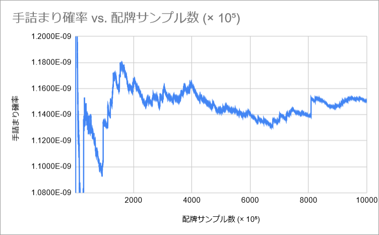
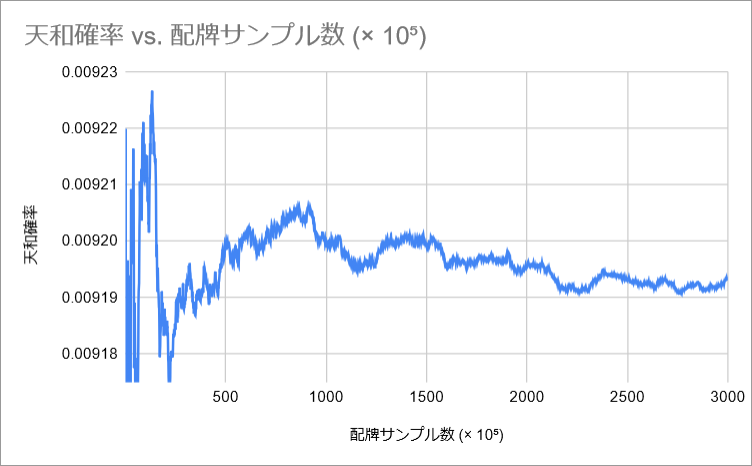

# lauzait-cep

## リンク集
- [lanerme_traditional_games](https://github.com/yasusho/lanerme_traditional_games/tree/master/lauzait_cep)
- [ルール説明 Google Docs](https://docs.google.com/document/d/1tgSXsoIldTofgbA7d3qZzh4NP_4INRg0FowBBGvt-H4/edit#heading=h.hpx4vm67t4f2)

## スクリプトの実行方法

deno を入れて

```bash
deno run index.ts
```

## 配牌時の手詰まり確率

計算:

```js
calculateStuckProbability(1e9)
```

ファイル: initially_stuck.txt

グラフ図示: https://docs.google.com/spreadsheets/d/1xNfpjH-QGHg32vDoLSKOzt4VY2htTnnptI7sIBVg6Tg/edit#gid=0




## 配牌時の天和確率

計算:

```js
calculateTianhuProbability(3e8)
```

ファイル: tianhu.txt

グラフ図示: https://docs.google.com/spreadsheets/d/1xNfpjH-QGHg32vDoLSKOzt4VY2htTnnptI7sIBVg6Tg/edit#gid=515372649


